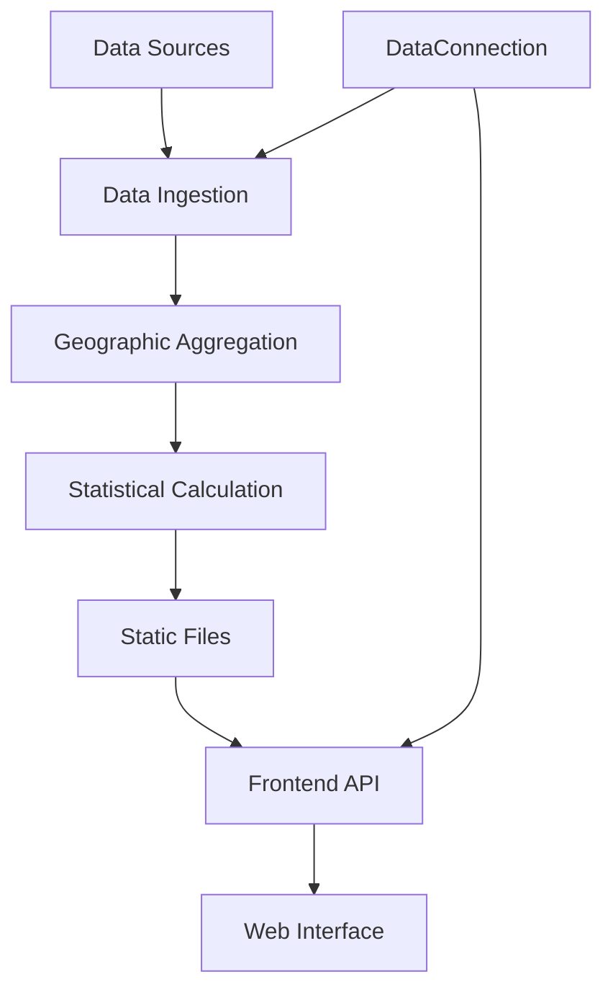

# RE Market Tool

A comprehensive real estate market analysis tool with **hybrid architecture** supporting both static (GitHub Pages) and dynamic (Flask server) deployments. Features multi-level geographic aggregation, statistical analysis, and flexible data connection management.

## 🎯 **Current Status (2025-10-06)**

**🟢 PRODUCTION READY** - System fully tested and validated
- **Data Sources**: 39 connections managed via flexible registry
- **Architecture**: Hybrid (Static + Dynamic frontend)
- **ETL Pipeline**: Fully functional (1.48s processing time)
- **Deployment**: Ready for GitHub Pages + Flask server
- **Last Test**: Complete system reset and validation successful

## 🚀 Quick Start

### 1. Setup Environment
```bash
# Clone and setup
git clone <repository-url>
cd RE
./setup_env.sh
```

### 2. Run ETL Pipeline
```bash
# Full pipeline (ingestion → aggregation → statistics)
cd backend/scripts
python update.py --full

# Or individual steps
python update.py --ingestion
python update.py --aggregation  
python update.py --calculation
```

### 3. Start Frontend
```bash
# Option A: Static Frontend (GitHub Pages ready)
cd frontend
python -m http.server 8000
# Access: http://localhost:8000

# Option B: Dynamic Frontend (Full functionality)
cd frontend
python frontend_script.py
# Access: http://localhost:5000
```

## 📁 Project Structure

```
RE/
├── README.md                    # This file - project overview
├── README_HISTORY.md           # Development log and tracker
├── WORKFLOW_DIAGRAM.md         # System architecture diagrams
├── setup_env.sh               # Environment setup
├── requirements.txt           # Production dependencies
├── requirements-dev.txt       # Development dependencies
├── check_env.py              # Environment validation
│
├── backend/                   # Data processing backend
│   ├── scripts/              # ETL pipeline scripts
│   │   ├── update.py         # Main orchestrator
│   │   ├── ingest.py         # Data ingestion
│   │   ├── aggregate.py      # Geographic aggregation
│   │   ├── calculate.py      # Statistical calculations
│   │   └── data_connection.py # Data source management
│   ├── data/                 # Data storage
│   ├── aggregations/         # Geographic aggregations
│   ├── statistics/           # Pre-calculated statistics
│   └── logs/                # System logs
│
└── frontend/                 # Web interface
    ├── frontend_script.py    # Flask server
    ├── templates/           # HTML templates
    ├── static/             # CSS/JS assets
    └── start_frontend.sh   # Startup script
```

## 🎯 Key Features

### Backend
- **Multi-Source Data Ingestion**: Zillow ZHVI/ZORI with master copy management
- **Geographic Aggregation**: ZIP → City → County → State → State Region → Region
- **Statistical Analysis**: 20+ statistics including trends, volatility, market health
- **Data Connection Management**: Centralized metadata and connection logic
- **Graceful Degradation**: Handles missing dependencies and data gracefully

### Frontend
- **Data Source Selector**: Dropdown populated from DataConnection class
- **Overview Dashboard**: Market metrics and key statistics
- **Time Series Analysis**: Historical trends and period-over-period changes
- **Add New Data Sources**: Interface for expanding data coverage
- **Responsive Design**: Modern UI with mobile support

## 📊 Data Sources

Currently supports:
- **Zillow ZHVI**: Home Value Index (6 variants)
- **Zillow ZORI**: Observed Rent Index
- **Geographic Levels**: Metro, State, County, City, ZIP, Neighborhood

## 🔧 Development

### Backend Development
See [backend/README.md](backend/README.md) for detailed backend documentation.

### Frontend Development  
See [frontend/README.md](frontend/README.md) for detailed frontend documentation.

### Project History
See [README_HISTORY.md](README_HISTORY.md) for complete development log and decisions.

## 📈 System Architecture



## 🚀 Deployment

### Local Development
```bash
# Backend only
cd backend/scripts && python update.py --full

# Frontend only  
cd frontend && ./start_frontend.sh

# Full stack
# Terminal 1: Backend
cd backend/scripts && python update.py --full
# Terminal 2: Frontend
cd frontend && ./start_frontend.sh
```

### Production
- Backend: Run ETL pipeline on schedule (cron, GitHub Actions)
- Frontend: Deploy Flask app to cloud platform
- Storage: Use cloud storage for large datasets

## 📋 Current Status

- ✅ **Phase 1**: Architecture analysis and redesign
- ✅ **Phase 2**: Backend ETL pipeline implementation  
- ✅ **Phase 3**: Frontend web interface
- 🔄 **Phase 4**: Production deployment and optimization

## 🤝 Contributing

1. Fork the repository
2. Create a feature branch
3. Make changes following the existing architecture
4. Test thoroughly
5. Submit a pull request

## 📄 License

[Add your license here]

## 🆘 Support

- **Issues**: Create GitHub issues for bugs or feature requests
- **Documentation**: Check component-specific READMEs
- **Development Log**: See README_HISTORY.md for context
