# RE Market Tool - Workflow Diagram

## 🔄 Enhanced Data Ingestion Workflow

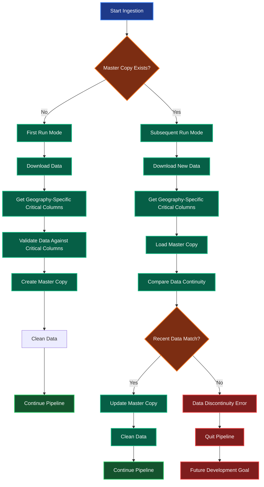

## 🗺️ Dynamic Critical Columns Validation

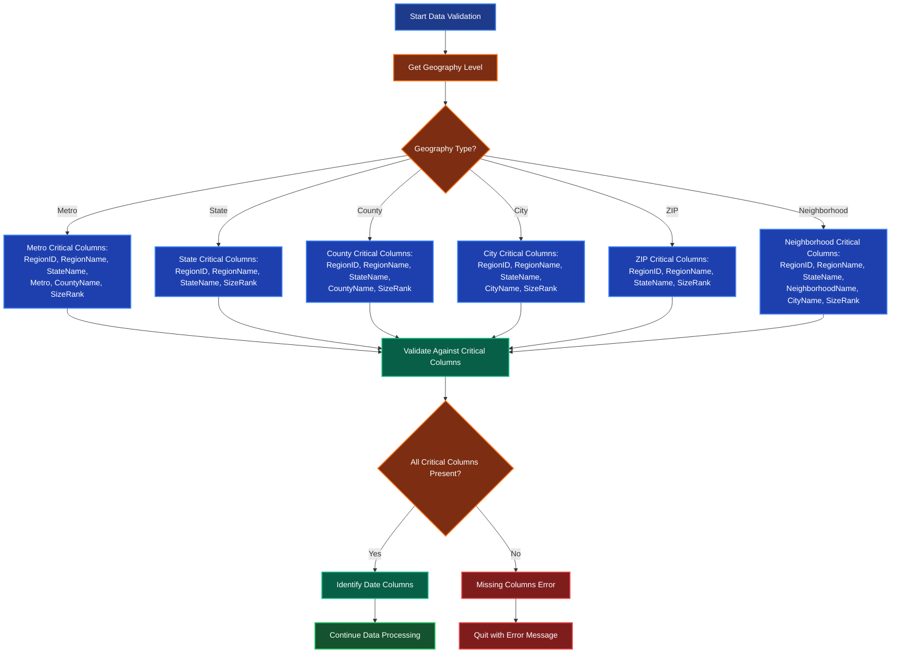

## 🔄 Complete System Workflow

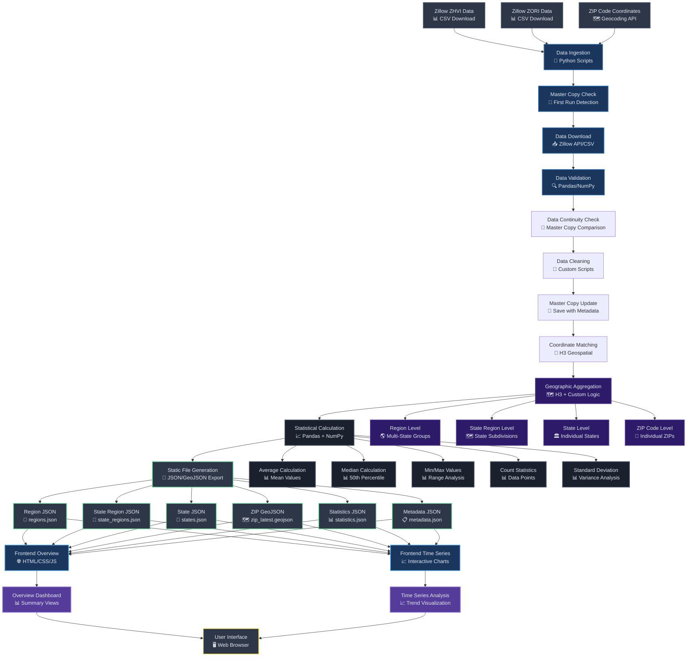

## 🏗️ Backend Processing Pipeline

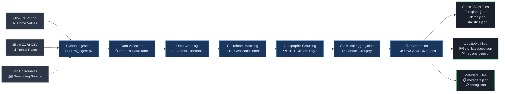

## 🎨 Frontend Architecture

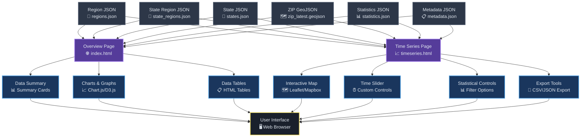

## 📊 Data Flow Sequence

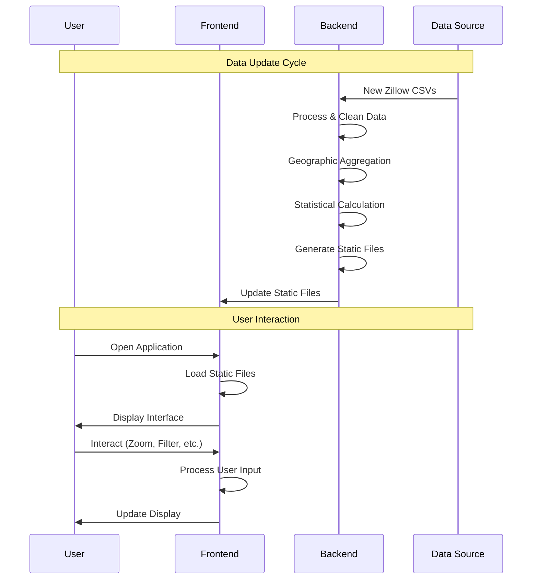

## 🔄 Geographic Aggregation Flow

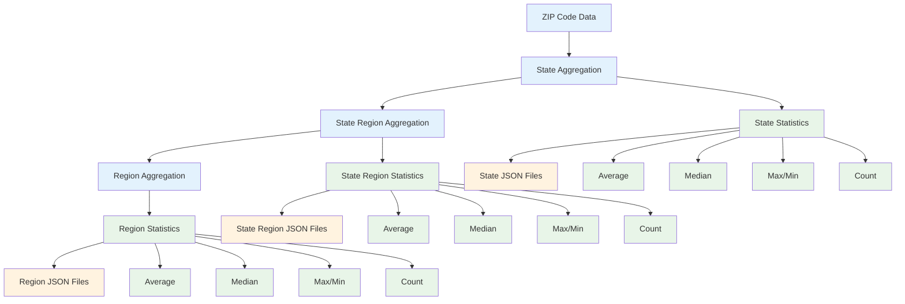

## ⚡ Performance Optimization

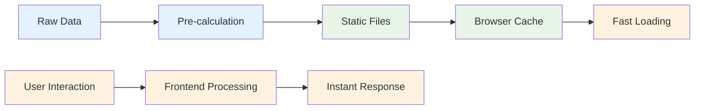

## DataConnection Class Architecture

### Three-Level Hierarchy Structure

```mermaid
graph TD
    A[RE Data Connection] --> B[Zillow Data Connection]
    A --> C[Future: Redfin Data Connection]
    A --> D[Future: CoreLogic Data Connection]
    
    B --> E[ZHVI Data Type]
    B --> F[ZORI Data Type]
    
    E --> G[All Homes Smoothed Seasonally Adjusted]
    E --> H[All Homes Raw Mid-Tier]
    E --> I[All Homes Top-Tier]
    E --> J[All Homes Bottom-Tier]
    E --> K[Single-Family Homes]
    E --> L[Condo/Co-op]
    
    F --> M[All Homes]
    
    G --> N[Metro Geography]
    G --> O[State Geography]
    G --> P[County Geography]
    G --> Q[City Geography]
    G --> R[ZIP Geography]
    G --> S[Neighborhood Geography]
    
    H --> T[Metro Geography]
    H --> U[State Geography]
    H --> V[County Geography]
    H --> W[City Geography]
    H --> X[ZIP Geography]
    H --> Y[Neighborhood Geography]
    
    I --> Z[Metro Geography]
    I --> AA[State Geography]
    I --> BB[County Geography]
    I --> CC[City Geography]
    I --> DD[ZIP Geography]
    I --> EE[Neighborhood Geography]
    
    J --> FF[Metro Geography]
    J --> GG[State Geography]
    J --> HH[County Geography]
    J --> II[City Geography]
    J --> JJ[ZIP Geography]
    J --> KK[Neighborhood Geography]
    
    K --> LL[Metro Geography]
    K --> MM[State Geography]
    K --> NN[County Geography]
    K --> OO[City Geography]
    K --> PP[ZIP Geography]
    K --> QQ[Neighborhood Geography]
    
    L --> RR[Metro Geography]
    L --> SS[State Geography]
    L --> TT[County Geography]
    L --> UU[City Geography]
    L --> VV[ZIP Geography]
    L --> WW[Neighborhood Geography]
    
    M --> XX[ZIP Geography]
    
    classDef re fill:#1976d2,stroke:#fff,stroke-width:2px,color:#fff
    classDef zillow fill:#388e3c,stroke:#fff,stroke-width:2px,color:#fff
    classDef future fill:#f57c00,stroke:#fff,stroke-width:2px,color:#fff
    classDef datatype fill:#7b1fa2,stroke:#fff,stroke-width:2px,color:#fff
    classDef subtype fill:#c2185b,stroke:#fff,stroke-width:2px,color:#fff
    classDef geography fill:#d32f2f,stroke:#fff,stroke-width:2px,color:#fff
    
    class A re
    class B zillow
    class C,D future
    class E,F datatype
    class G,H,I,J,K,L,M subtype
    class N,O,P,Q,R,S,T,U,V,W,X,Y,Z,AA,BB,CC,DD,EE,FF,GG,HH,II,JJ,KK,LL,MM,NN,OO,PP,QQ,RR,SS,TT,UU,VV,WW,XX geography
```

### DataConnection Method Flow

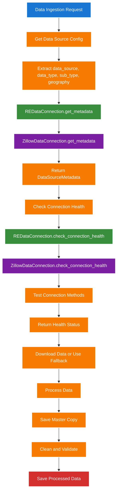

### DataConnection Coverage Summary

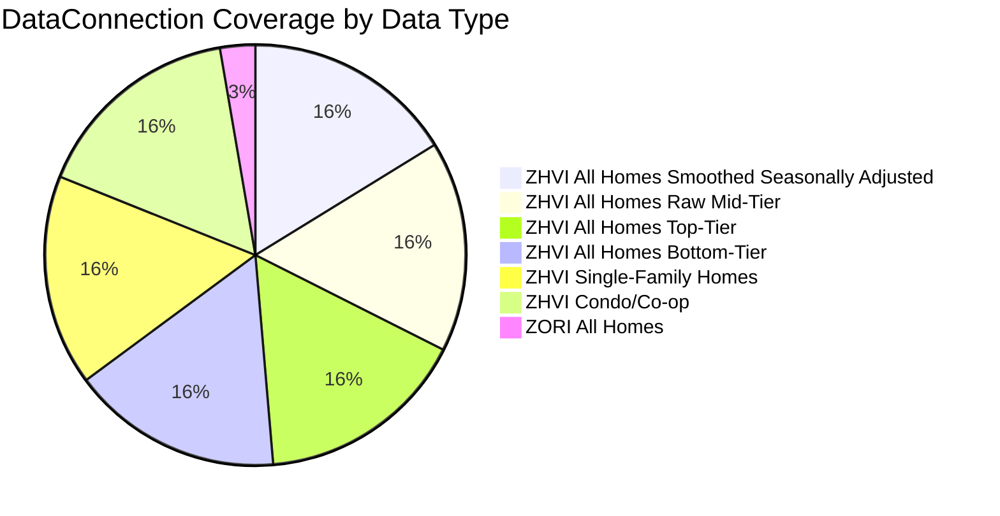

### Geography Coverage by Data Type

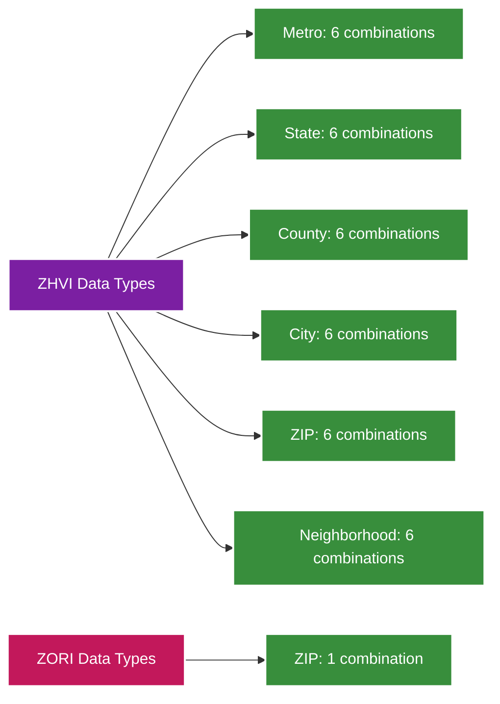

## Complete ETL Pipeline Testing & Enhancement

### Enhanced Statistical Calculation with Graceful Degradation

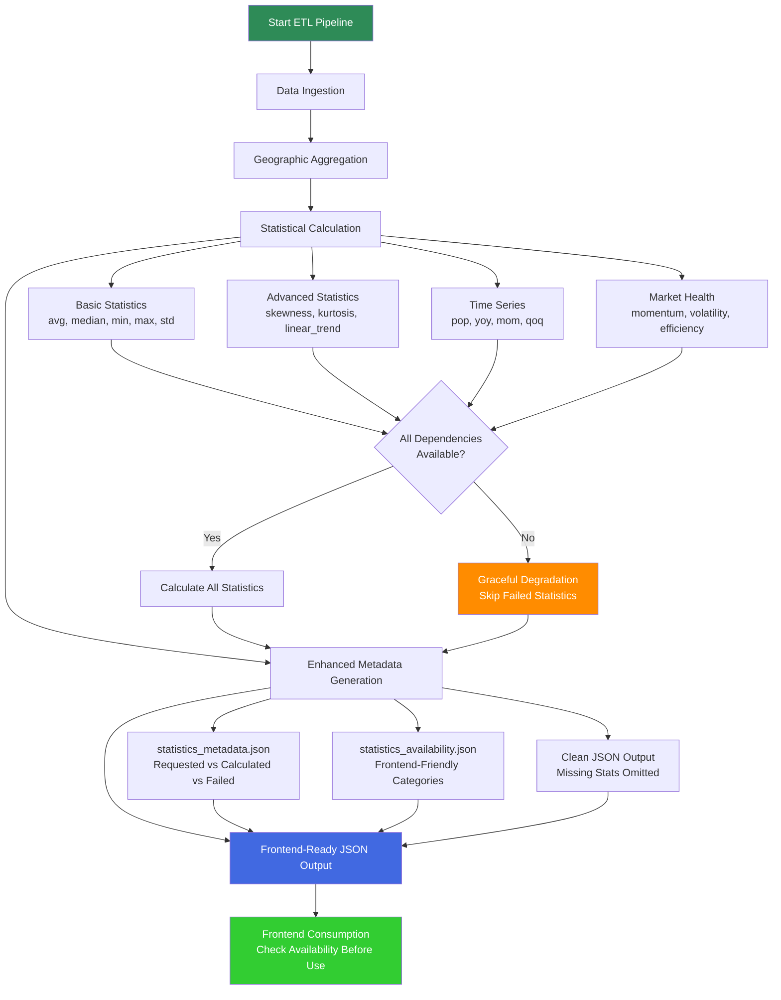

### Frontend JSON Consumption Strategy

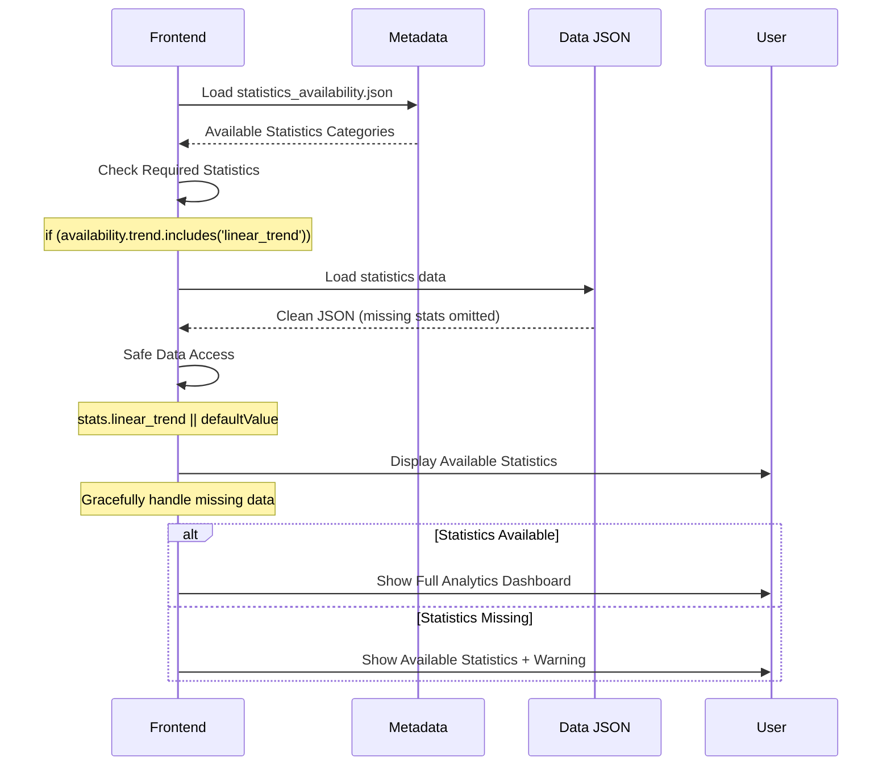

### SciPy Dependency Management

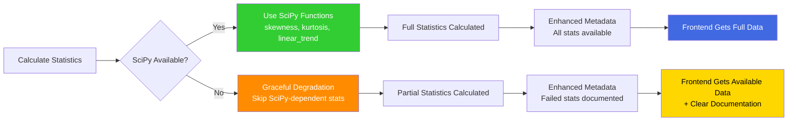
