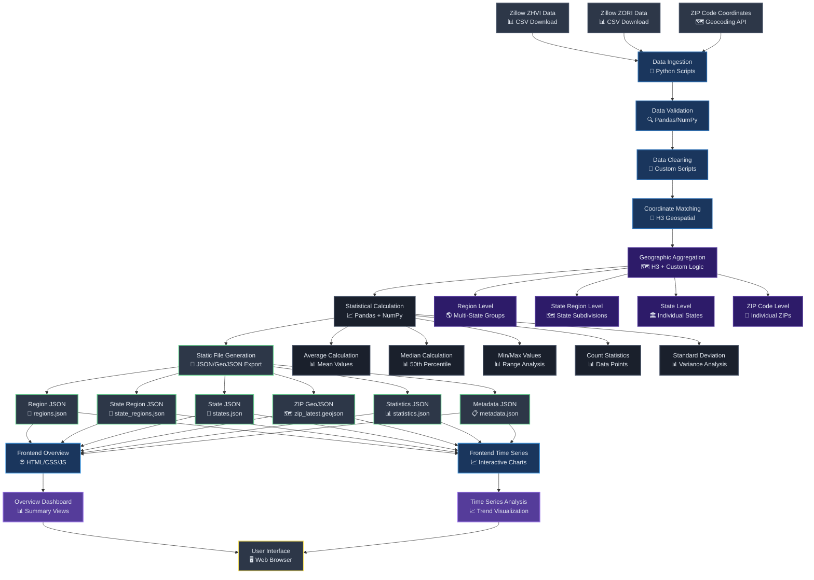
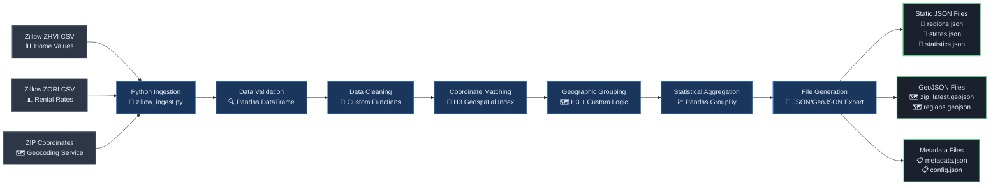
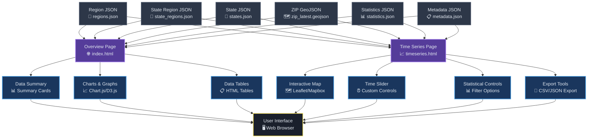
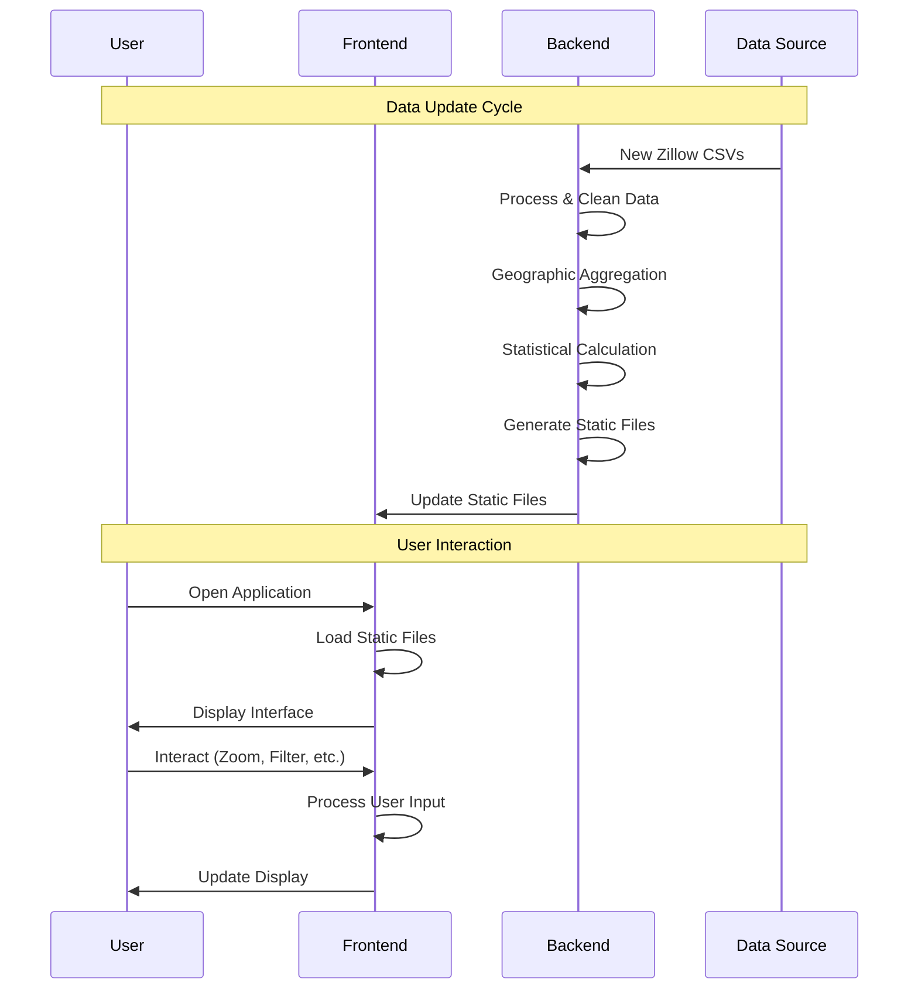
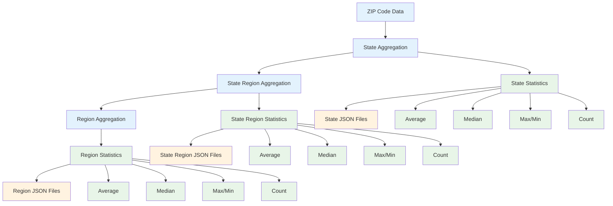
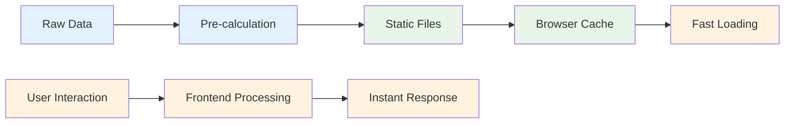

# RE Market Tool - Workflow Diagram

## 🔄 Complete System Workflow

## 🏗️ Backend Processing Pipeline

## 🎨 Frontend Architecture

## 📊 Data Flow Sequence

## 🔄 Geographic Aggregation Flow

## ⚡ Performance Optimization

