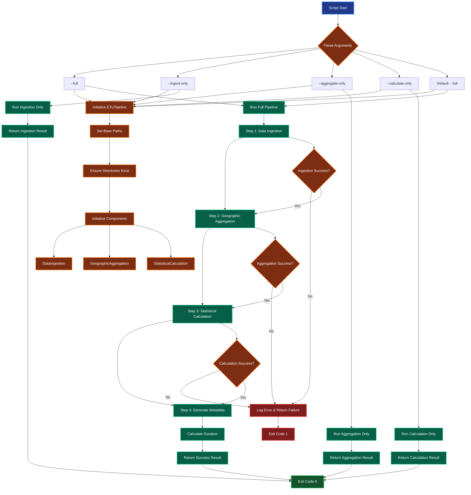
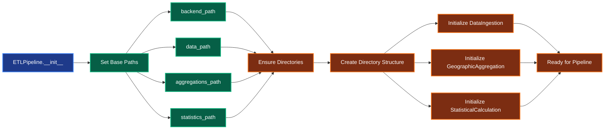
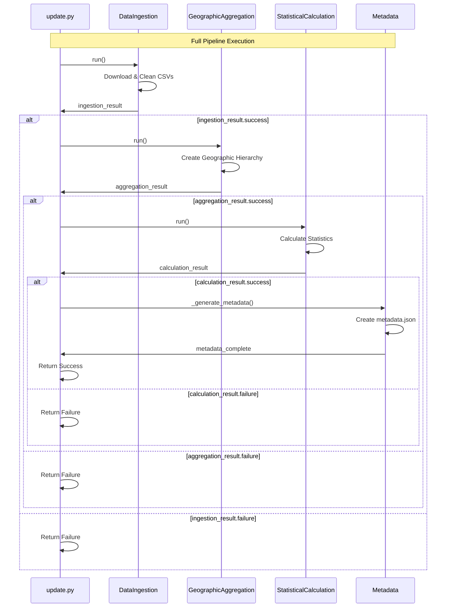
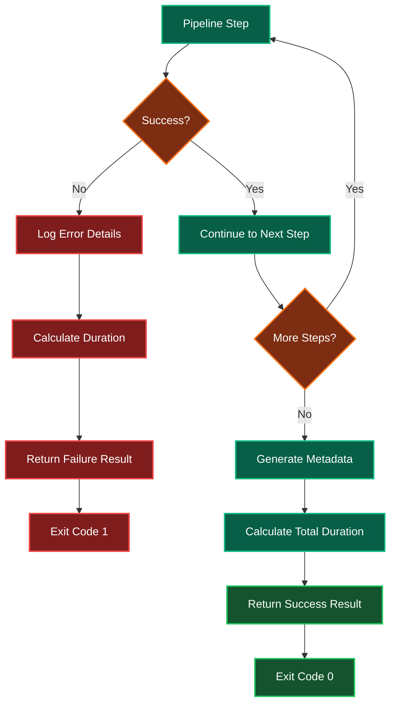
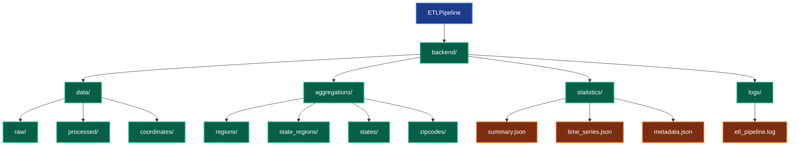

# Update.py Script Flow Diagram

## 🔄 ETL Pipeline Orchestrator Flow

## 🏗️ Component Initialization Flow

## 📊 Full Pipeline Execution Flow

## 🔧 Error Handling Flow

## 📁 Directory Structure Created

