# Update.py Script Flow Diagram

## 🔄 Enhanced Data Ingestion Workflow

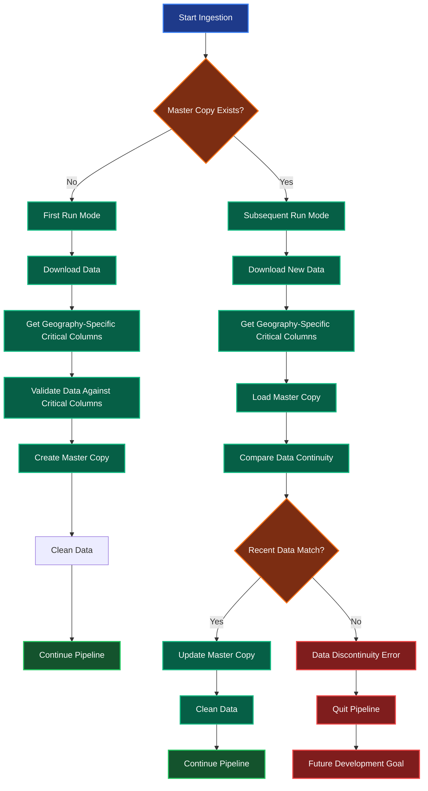

## 🗺️ Dynamic Critical Columns Validation

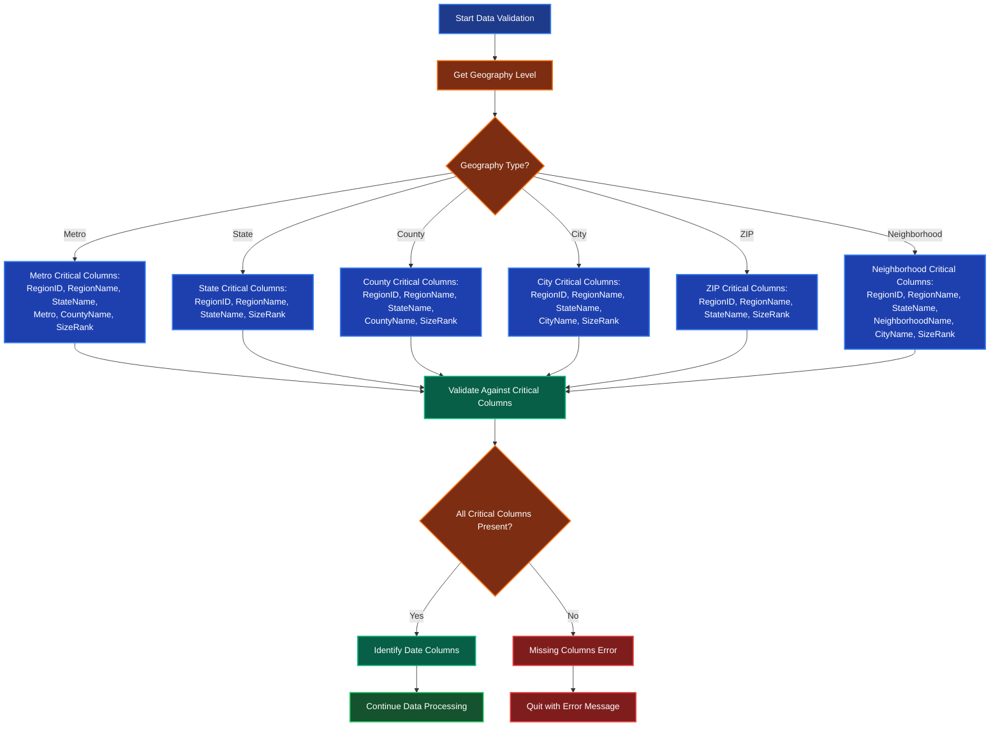

## 🔄 ETL Pipeline Orchestrator Flow

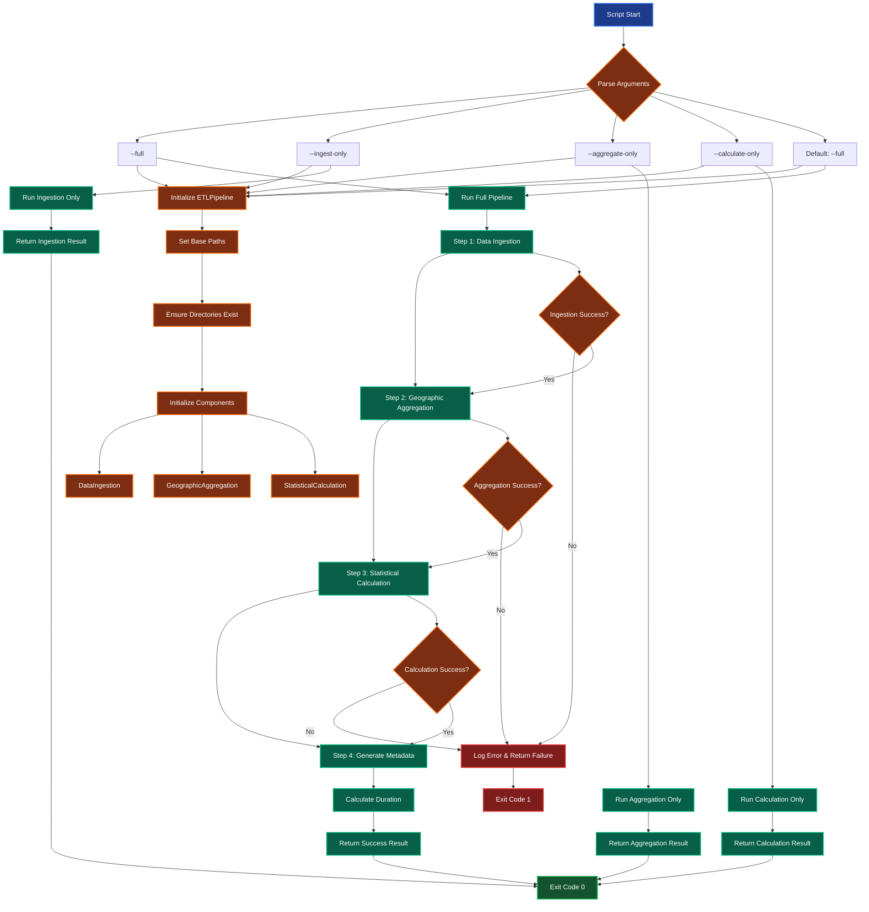

## 🏗️ Component Initialization Flow

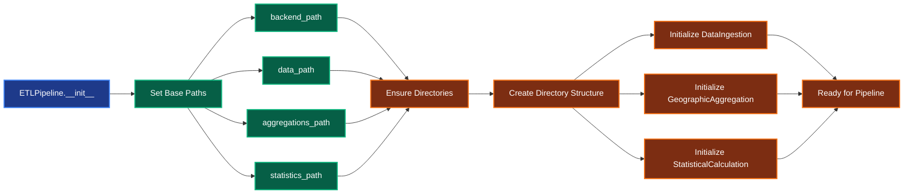

## 📊 Full Pipeline Execution Flow

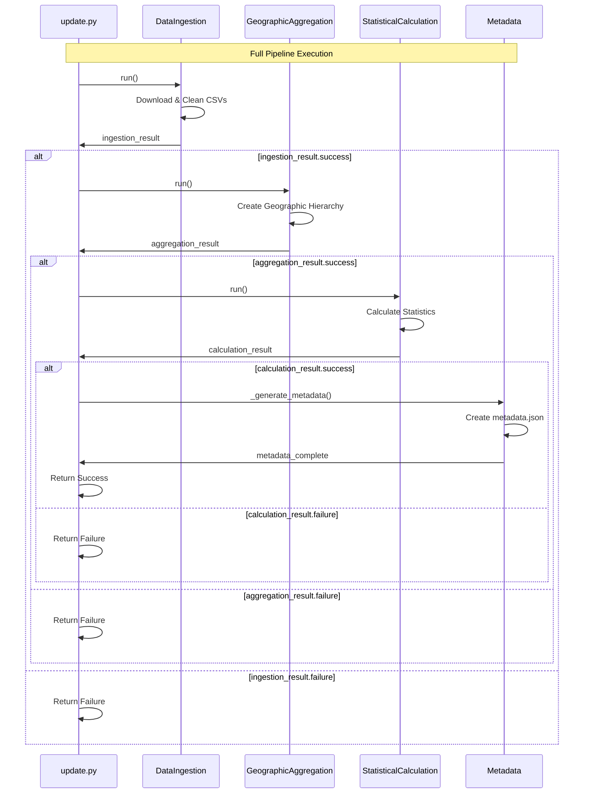

## 🔧 Error Handling Flow

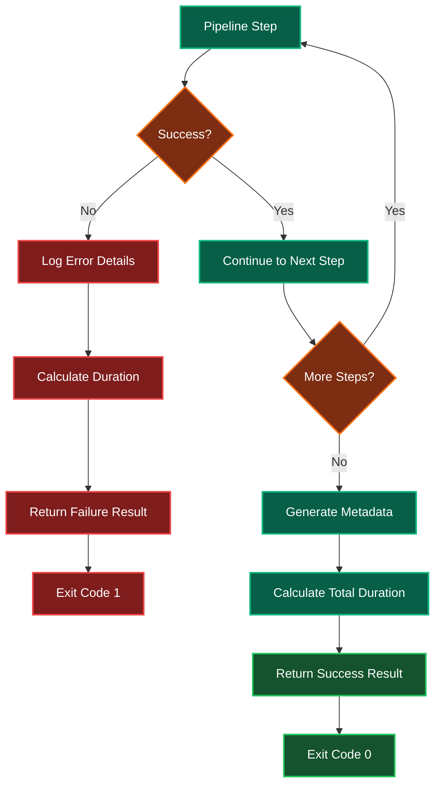

## 📁 Directory Structure Created

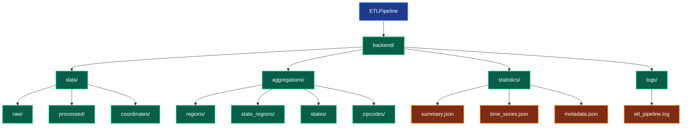

## DataConnection Integration in ETL Pipeline

### DataConnection Class Hierarchy in Pipeline Context

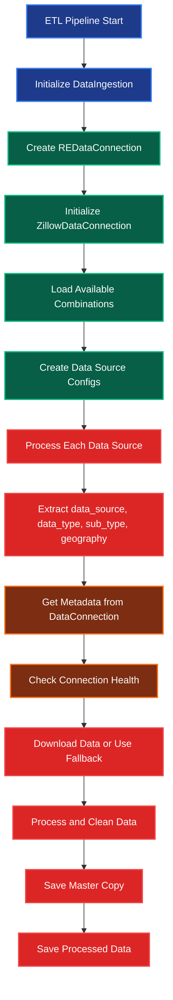

### DataConnection Method Flow in Pipeline

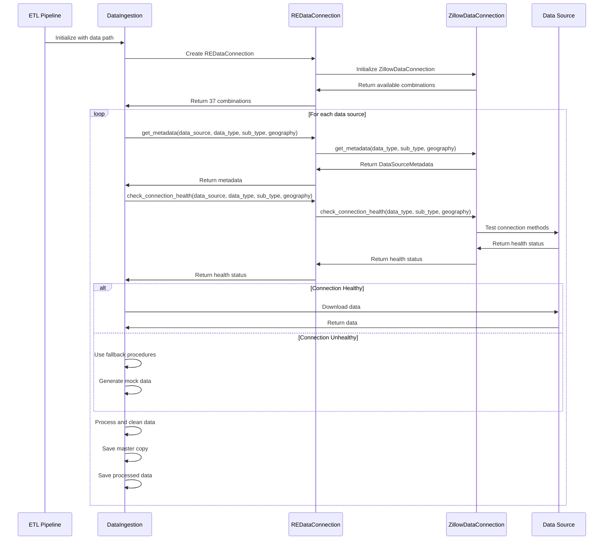

### DataConnection Coverage in Pipeline

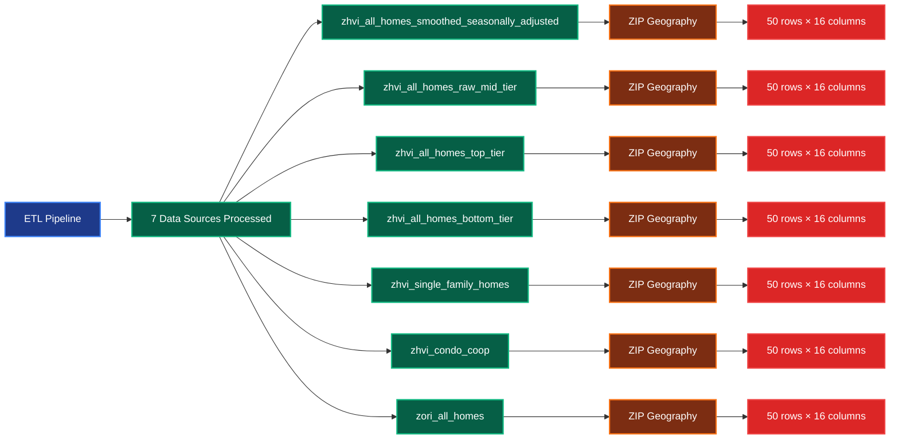

### Pipeline Performance with DataConnection

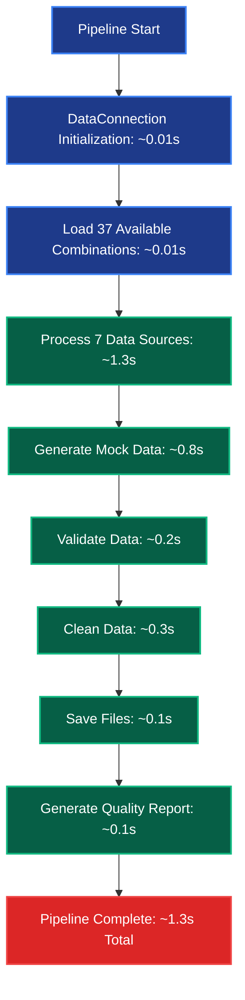
